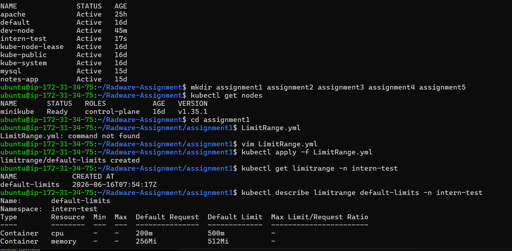
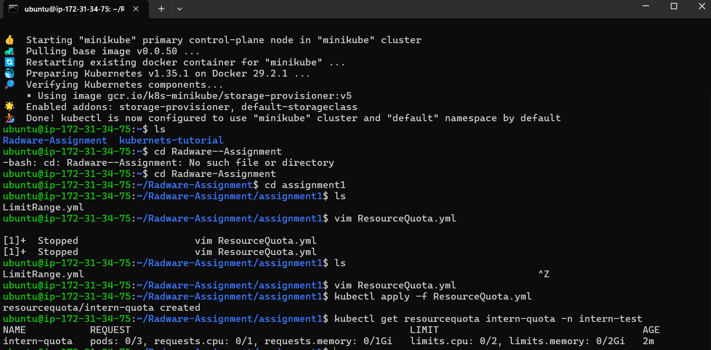
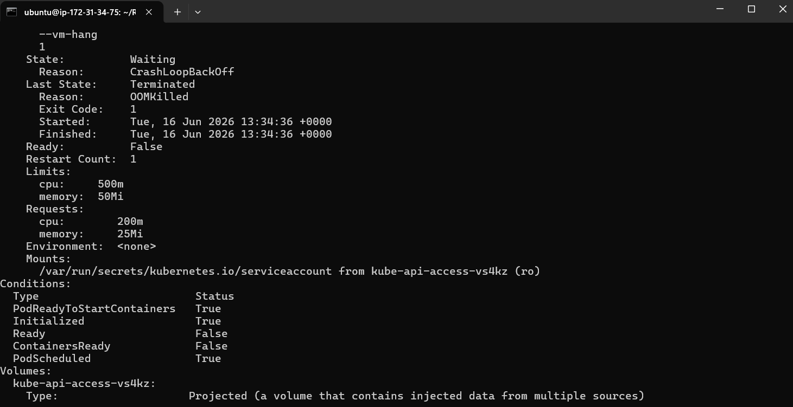
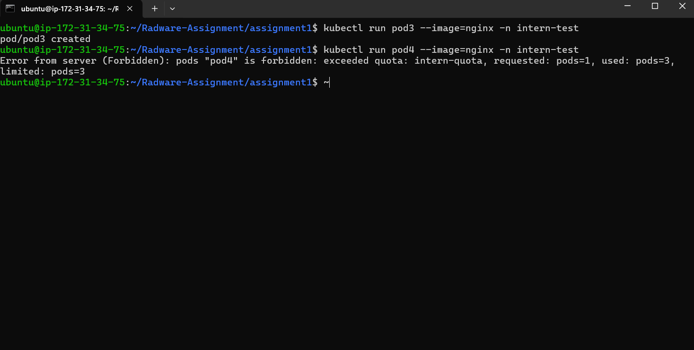

# Assignment 1: Resource Governance and Failure Modes

## Objective

Validate practical understanding of Requests, Limits, LimitRange, ResourceQuota, OOMKilled behavior, and quota enforcement.

## Resources Created

* Namespace: intern-test
* LimitRange: intern-limitrange
* ResourceQuota: intern-quota
* Pod: good-pod
* Pod: oom-pod

## Validation

### LimitRange

Configured default CPU and memory requests/limits for containers.

### ResourceQuota

Configured hard limits for:

* Pods
* requests.cpu
* requests.memory
* limits.cpu
* limits.memory

### Successful Pod

good-pod was created successfully and inherited resource values from LimitRange.

### OOMKilled Pod

oom-pod was configured with a low memory limit and intentionally exceeded it.

Result:

* Pod entered CrashLoopBackOff state
* Container termination reason: OOMKilled

## Screenshots

### LimitRange Output

### ResourceQuota Output

### OOMKilled Evidence

### Quota Exceeded Evidence

## OOMKill vs Quota Denial

OOMKill occurs when a running container exceeds its configured memory limit. Kubernetes terminates the container to protect node stability.

Quota denial occurs before a resource is created. The API server rejects the request because the namespace has exceeded its configured ResourceQuota.

OOMKill affects running workloads, while quota denial prevents new workloads from being created.
