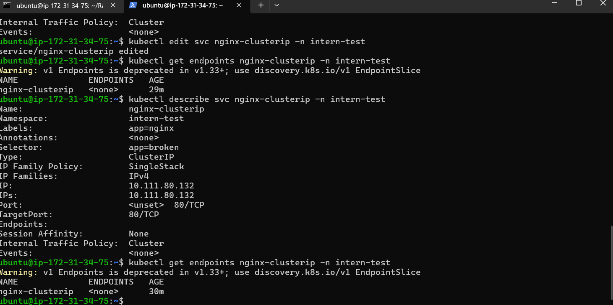
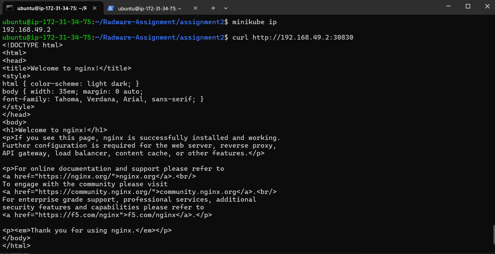
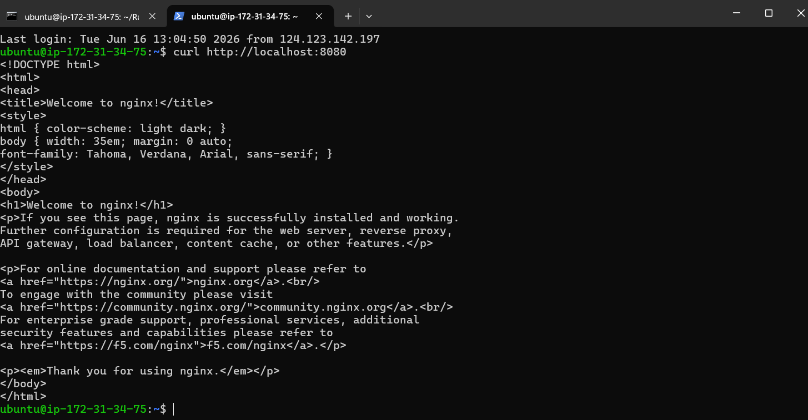
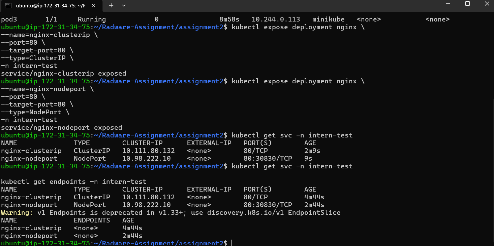

# Assignment 2: Service Exposure and Endpoint Debugging

## Objective

Test internal and external service access and troubleshoot service-to-pod mapping using Kubernetes Services.

## Tasks Completed

1. Deployed an Nginx Deployment with 3 replicas.
2. Exposed the deployment using ClusterIP and NodePort Services.
3. Validated ClusterIP access from inside the cluster using a temporary debug pod.
4. Validated NodePort access from the host machine.
5. Used port-forwarding to access the service locally.
6. Intentionally broke the service selector, diagnosed the issue, and restored connectivity.

---

## Resources Created

### Deployment

* nginx Deployment
* Replicas: 3

### Services

* nginx-clusterip (ClusterIP)
* nginx-nodeport (NodePort)

---

## ClusterIP Validation

The ClusterIP service was tested from inside the cluster using a temporary debug pod.

The service successfully returned the Nginx welcome page, proving internal cluster communication was working correctly.

### Evidence



---

## NodePort Validation

The NodePort service was accessed externally using the Minikube node IP and allocated NodePort.

Command used:

```bash
curl http://<minikube-ip>:30830
```

The Nginx welcome page was returned successfully.

### Evidence



---

## Service Port Forward Validation

Port forwarding was used to access the service locally without exposing it externally.

Command used:

```bash
kubectl port-forward svc/nginx-clusterip 8080:80 -n intern-test
```

Validation:

```bash
curl http://localhost:8080
```

The Nginx welcome page was returned successfully.

### Evidence



---

## Endpoint Verification

Initially, the service endpoints were unavailable.

This indicated that the service was unable to route traffic to any backend pods.

### Evidence



---

## Selector Break Test

The service selector was intentionally modified to an incorrect value.

Example:

```yaml
selector:
  app: broken
```

Result:

* Service endpoints became empty.
* Traffic to the service failed.
* The service could no longer identify backend pods.

After restoring the correct selector:

```yaml
selector:
  app: nginx
```

the service recovered and traffic routing resumed normally.

---

## Service Access Methods

### ClusterIP

Used for communication between applications running inside the Kubernetes cluster.

**Use when:**

* Internal microservice communication
* Backend-to-backend communication
* Applications do not need external access

### NodePort

Exposes an application externally through a node IP and port.

**Use when:**

* Testing applications from outside the cluster
* Small environments and labs
* Demonstrations and development clusters

### Port Forward

Creates a temporary tunnel from the local machine to a pod or service.

**Use when:**

* Debugging applications
* Accessing services without exposing them externally
* Local development and troubleshooting

---

## Conclusion

This assignment demonstrated Kubernetes Service fundamentals, including ClusterIP, NodePort, port-forwarding, endpoint verification, and selector troubleshooting.

Internal access, external access, and service recovery after selector misconfiguration were successfully validated.
