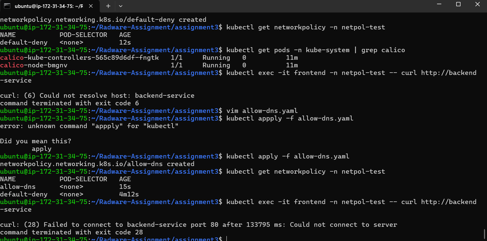
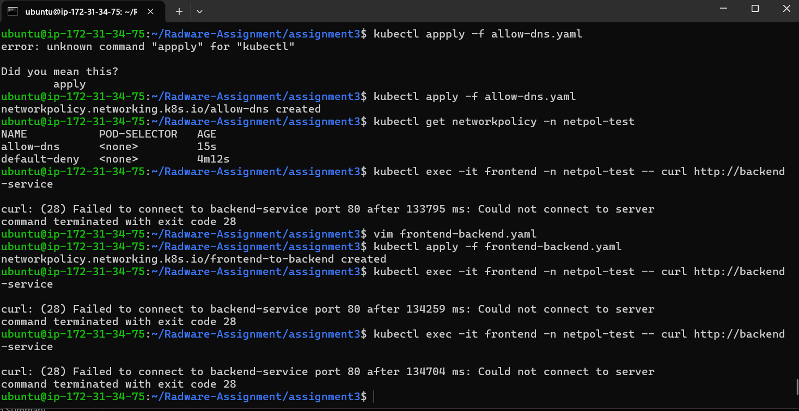
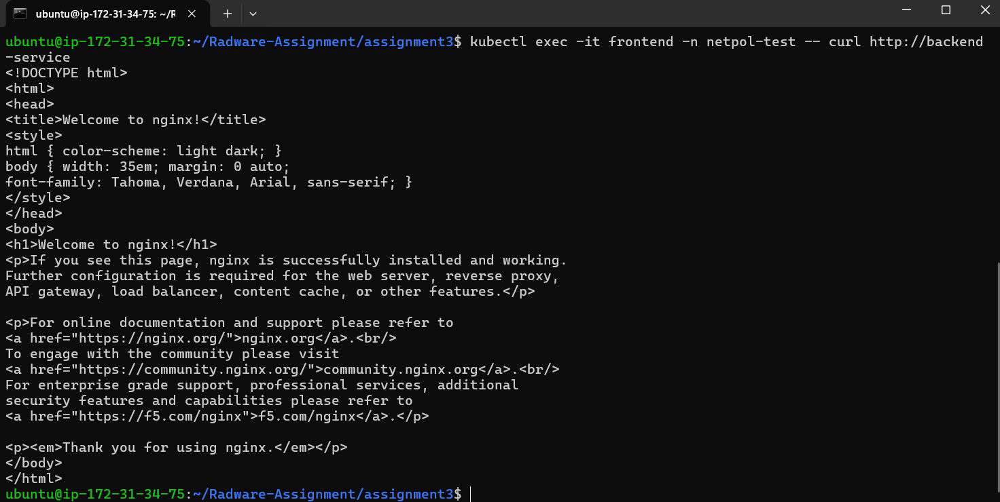
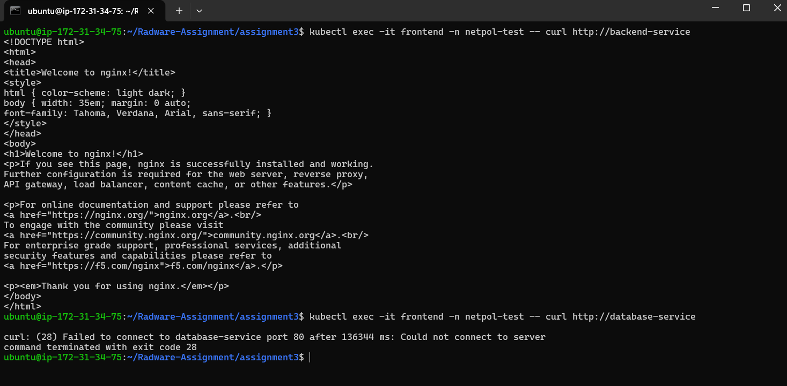
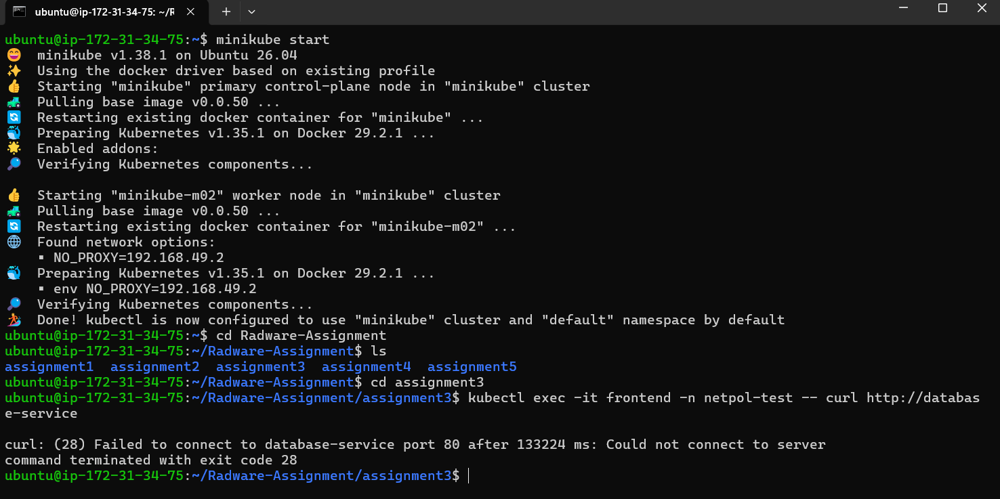
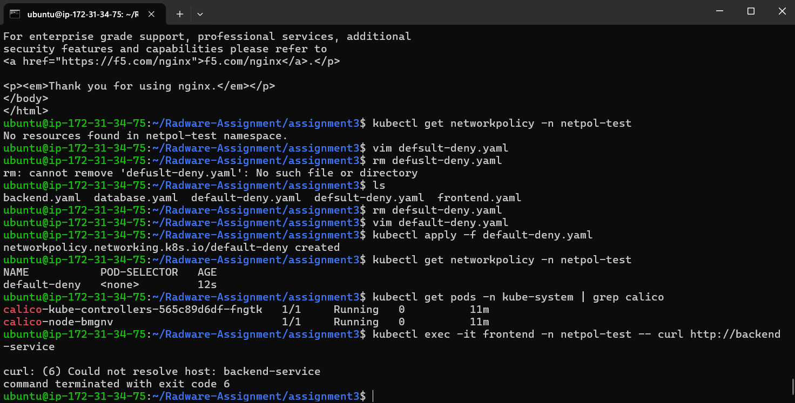

# Assignment 3: NetworkPolicy with DNS-Safe Zero Trust

## Objective

Implement a DNS-safe zero-trust network model using Kubernetes NetworkPolicies.

## Tasks Completed

1. Created frontend, backend, and database pods.
2. Applied a default deny NetworkPolicy.
3. Enabled DNS access using a dedicated DNS policy.
4. Allowed frontend to communicate only with backend.
5. Allowed backend to communicate only with database.
6. Verified that frontend cannot directly access database.

---

## Resources Created

### Pods

* frontend
* backend
* database

### Services

* backend-service
* database-service

### Network Policies

* default-deny
* allow-dns
* frontend-to-backend
* frontend-egress-backend
* backend-to-database
* backend-egress-database

---

## Default Deny Policy

A default deny policy was applied to block all ingress and egress traffic within the namespace.

As expected, communication between pods stopped and service names could not be resolved.

### Evidence



---

## DNS Allow Policy

A dedicated DNS policy was applied to allow communication with CoreDNS.

Before applying the policy:

* Service names could not be resolved.

After applying the policy:

* DNS resolution worked correctly.
* Application traffic remained blocked until additional NetworkPolicies were configured.

### Evidence



---

## Frontend to Backend Communication

A policy was created to allow frontend pods to communicate with backend pods.

Validation:

```bash
kubectl exec -it frontend -n netpol-test -- curl http://backend-service
```

Result:

* Connection successful
* Nginx welcome page returned

### Evidence



---

## Backend to Database Communication

A policy was created to allow backend pods to communicate with database pods.

Validation:

```bash
kubectl exec -it backend -n netpol-test -- curl http://database-service
```

Result:

* Connection successful
* Nginx welcome page returned

### Evidence



---

## Frontend to Database Communication

No policy was created to allow frontend access to the database.

Validation:

```bash
kubectl exec -it frontend -n netpol-test -- curl http://database-service
```

Result:

* Connection blocked
* Request timed out

### Evidence



---

## Network Policies Verification

All required NetworkPolicies were successfully applied.

### Evidence



---

## Connectivity Matrix

| Source   | Destination | Result  |
| -------- | ----------- | ------- |
| Frontend | Backend     | Allowed |
| Backend  | Database    | Allowed |
| Frontend | Database    | Blocked |

---

## Conclusion

This assignment demonstrated the implementation of a DNS-safe zero-trust architecture using Kubernetes NetworkPolicies.

Only explicitly permitted communication paths were allowed:

* Frontend → Backend
* Backend → Database

All other traffic remained blocked, ensuring controlled and secure communication between application components.
