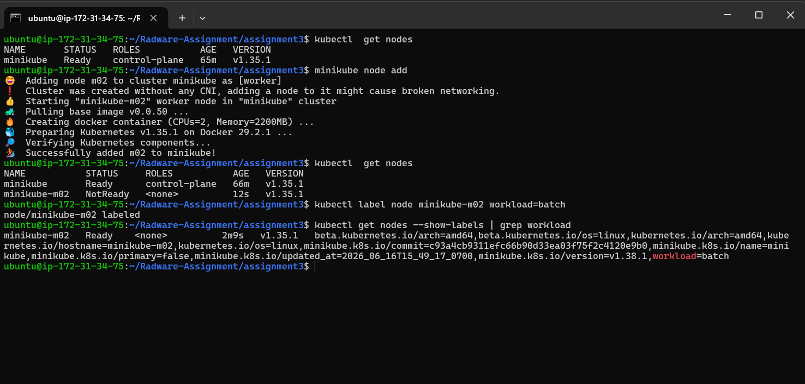
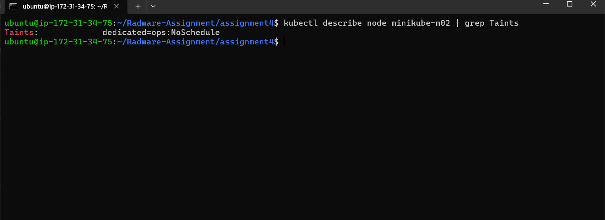
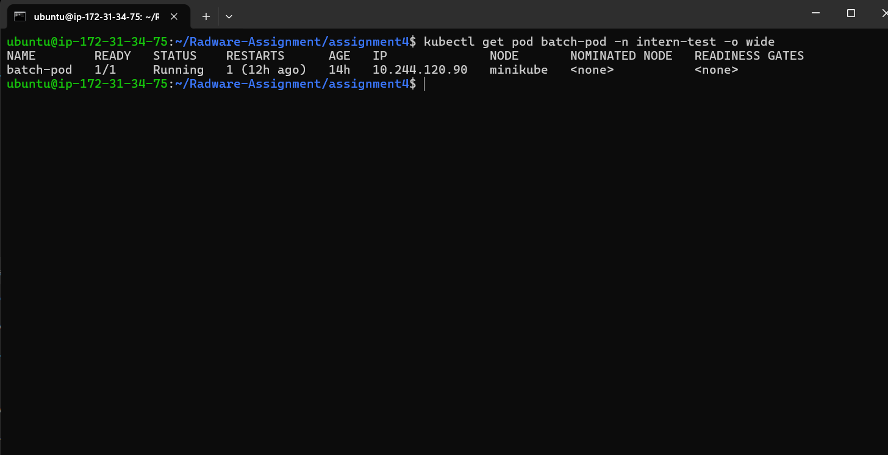
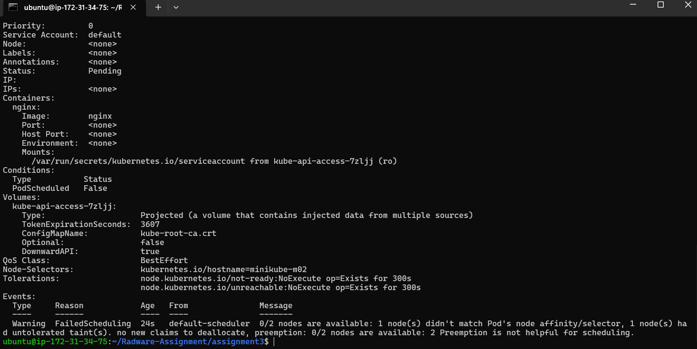
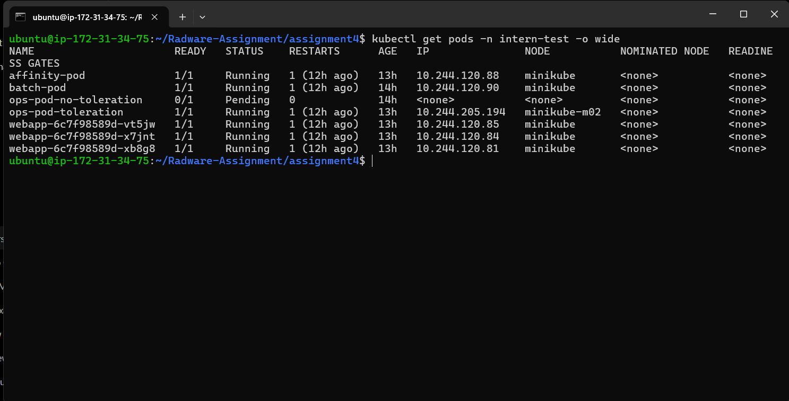

# Assignment 4: Scheduling Controls

## Objective

Demonstrate Kubernetes scheduling controls using Node Selectors, Taints, Tolerations, and Node Affinity.

## Tasks Completed

1. Added a second worker node to the Minikube cluster.
2. Applied a label (`workload=batch`) to the worker node.
3. Applied a taint (`dedicated=ops:NoSchedule`) to the worker node.
4. Scheduled a pod using a NodeSelector.
5. Verified scheduling failure for a pod without a toleration.
6. Verified successful scheduling for a pod with a matching toleration.
7. Scheduled a pod using Node Affinity.

---

## Cluster Preparation

A second worker node was added to the cluster and labeled for batch workloads.

### Node Label

```bash
kubectl label node minikube-m02 workload=batch
```

### Evidence



---

## Node Taint

A taint was applied to restrict scheduling on the worker node.

```bash
kubectl taint node minikube-m02 dedicated=ops:NoSchedule
```

### Evidence



---

## NodeSelector Scheduling

A pod named `batch-pod` was created with the following NodeSelector:

```yaml
nodeSelector:
  workload: batch
```

Result:

* Pod was successfully scheduled onto the node labeled `workload=batch`.

### Evidence



---

## Taints and Tolerations

### Pod Without Toleration

A pod was configured to run on the tainted node but did not include a matching toleration.

Result:

* Pod remained in Pending state.
* Scheduler rejected the pod because of the node taint.

### Evidence



---

### Pod With Toleration

A second pod was created with a matching toleration.

```yaml
tolerations:
- key: "dedicated"
  operator: "Equal"
  value: "ops"
  effect: "NoSchedule"
```

Result:

* Pod successfully scheduled onto the tainted node.
* Pod entered Running state.

### Evidence



---

## Node Affinity

A pod was created using Node Affinity rules to ensure scheduling only on nodes matching specific labels.

Example:

```yaml
affinity:
  nodeAffinity:
    requiredDuringSchedulingIgnoredDuringExecution:
```

Result:

* Pod successfully scheduled on a node matching the affinity requirements.

### Evidence


---

## Concepts Demonstrated

### NodeSelector

Schedules a pod onto nodes that contain specific labels.

### Taints

Prevent pods from being scheduled onto a node unless the pod explicitly tolerates the taint.

### Tolerations

Allow pods to be scheduled onto tainted nodes.

### Node Affinity

Provides advanced scheduling rules and greater flexibility than NodeSelector.

---

## Conclusion

This assignment demonstrated Kubernetes scheduling and workload placement mechanisms.

The following concepts were successfully validated:

* Node Labels
* NodeSelector
* Taints
* Tolerations
* Node Affinity

These features help control workload placement, isolate workloads, and improve cluster resource management.
