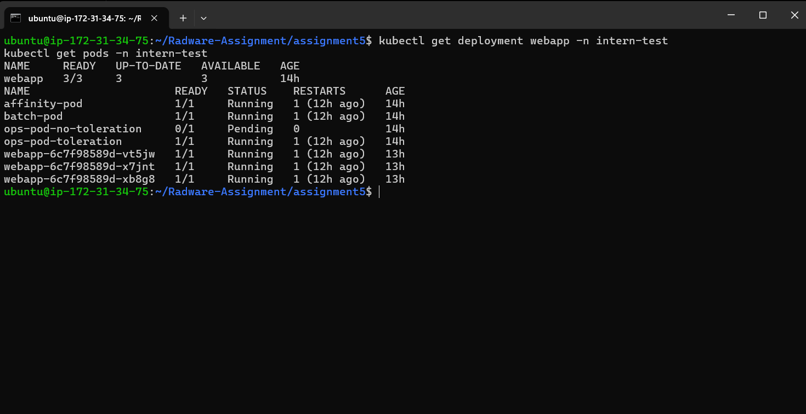
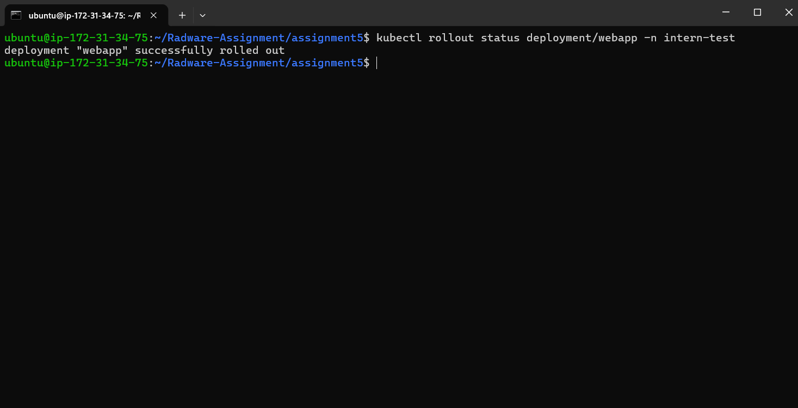
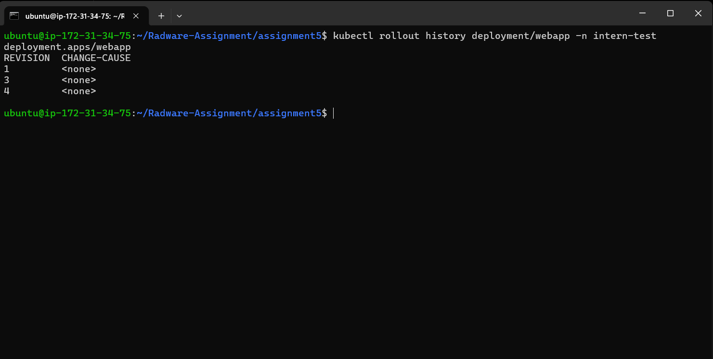
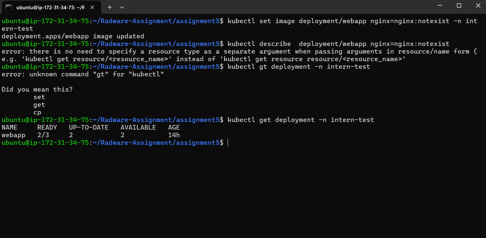
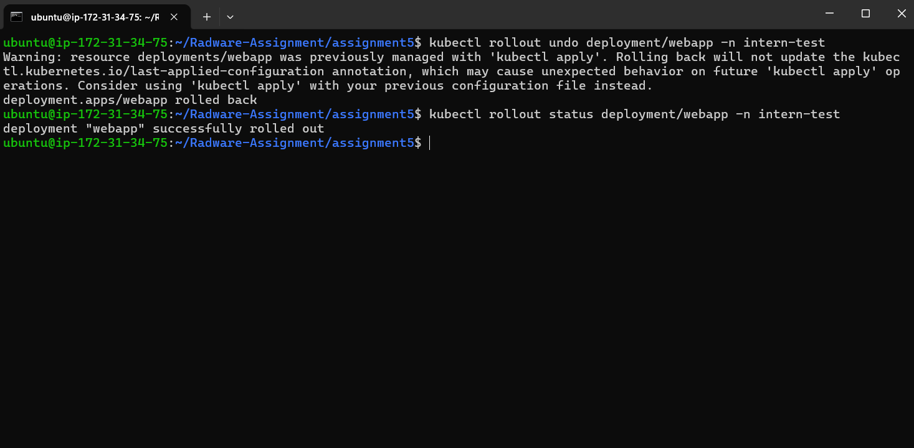
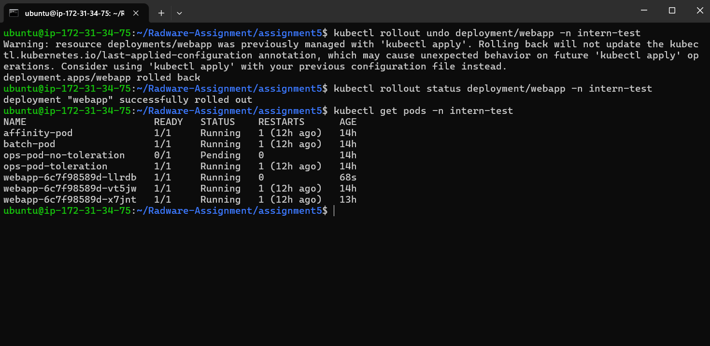

# Assignment 5: Controlled Production Change

## Objective

Demonstrate safe Kubernetes deployment updates using rolling updates, health probes, rollout history, and rollback mechanisms.

## Tasks Completed

1. Created a Deployment with 3 replicas.
2. Configured readiness and liveness probes.
3. Performed a rolling update.
4. Verified rollout status and rollout history.
5. Simulated a deployment failure using an invalid image.
6. Diagnosed the failure using pod events.
7. Rolled back to the previous working revision.

---

## Deployment Creation

A deployment named `webapp` was created with three replicas.

### Evidence



---

## Health Checks

The deployment was configured with:

### Readiness Probe

Ensures traffic is only routed to healthy containers.

### Liveness Probe

Detects unhealthy containers and automatically restarts them.

---

## Rolling Update

The deployment image was updated.

```bash
kubectl set image deployment/webapp nginx=nginx:1.26 -n intern-test
```

The rollout completed successfully.

### Evidence



---

## Rollout History

Deployment revisions were verified using rollout history.

### Evidence



---

## Failure Simulation

The deployment was intentionally updated with an invalid image.

```bash
kubectl set image deployment/webapp nginx=nginx:notexist -n intern-test
```

Result:

* New pods failed to start.
* Deployment entered ImagePullBackOff state.

### Evidence



---

## Rollback

The deployment was restored to the previous working revision.

```bash
kubectl rollout undo deployment/webapp -n intern-test
```

The rollback completed successfully.

### Evidence



---

## Final Validation

After rollback:

* All pods returned to Running state.
* Deployment became healthy again.

### Evidence



---

## Conclusion

This assignment demonstrated safe deployment management in Kubernetes.

The following concepts were successfully validated:

* Rolling Updates
* Readiness Probes
* Liveness Probes
* Rollout Status
* Rollout History
* Failure Diagnosis
* Rollback Recovery

These mechanisms help perform production changes safely while minimizing downtime and reducing deployment risk.
